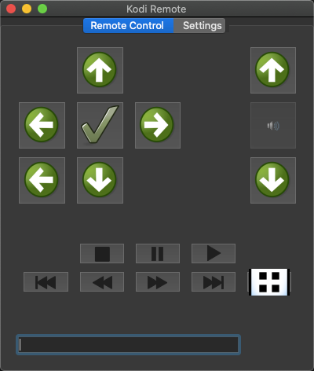
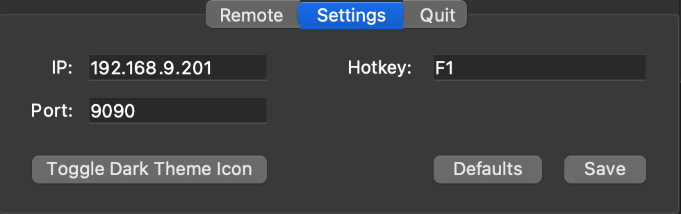

# qore2
Kodi remote written in Qt and created as a learning exercise. At present this in unfinished and the settings tab is purely cosmetic.

## Compiling and Configuration

1. Open qore2.pro file in Qt Creator.
2. Amend line 6 of connection.cpp to reflect your kodi config
3. Compile

## Screenshots

// Desktop icon
//     https://icons-for-free.com/Remote+Control-1320568044590850575/
//     https://creativecommons.org/licenses/by-nc-nd/4.0/                  CC BY-NC-ND 4.0

// QHotKey
//     https://github.com/Skycoder42/QHotkey
//     https://github.com/Skycoder42/QHotkey/blob/master/LICENSE           BSD 3

// Tray icon
//     https://iconscout.com/icon/remote-network-signal-range-setting
//     https://www.apache.org/licenses/LICENSE-2.0                         Apache 2.0
