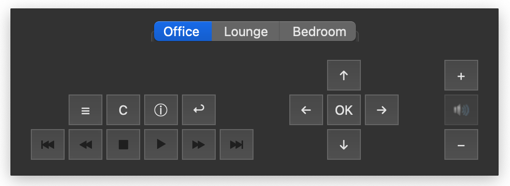
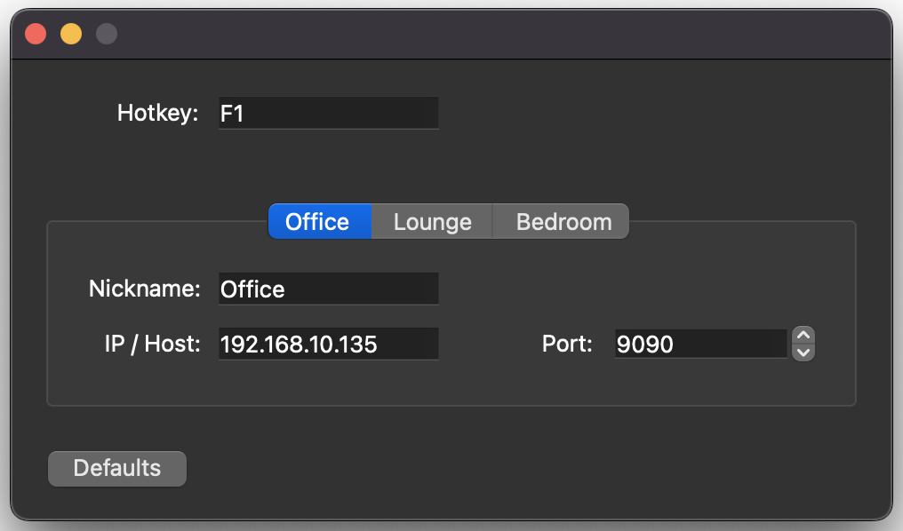

# Qore2 - Kodi remote
Kodi remote written in C++ using Qt 6.5. Qore2 is intended as a dropin replacement for [grantrutherford's](https://github.com/grantrutherford) excellent [MacOS dashboard remote](https://github.com/grantrutherford/kodi-remote-osx-widget) now that Apple have retired the MacOS dashboard.

Qore2 supports up to 3 Kodi instances, menu navigation, volume control, info and context functions, previous, rewind, play/pause, fast forward, next and facilitates sending text input too. The application runs in the menu bar/system tray and can be activated on a global hotkey or by clicking the icon.

Configuration includes defining the WebSocket IP/host and port for each Kodi instance, and a global hotkey binding and dark/light icon theme. At present I have no plans to support customisable Kodi input bindings, sorry.

Download the latest release [here](releases/Qore2-v1_1.zip).

## Shortcuts

* Skipprevious:	-
* Rewind: ,
* Big step backwards: Shift + Down arrow
* Step backwards: Shift + Left arrow
* Stop: x
* Play/Pause: spacebar
* Step forwards: Up arrow
* Big Step forwards: Shift + Up arrow
* Fast forward: .
* Skipnext:	=

* OSD menu:	m
* Context menu:	c
* Item info:	i

* Navigation: Arrow keys
* Select: Enter
* Back: Backspace

* Volume down:	[
* Volume up: ]
* Mute: \

## Compiling and Configuration

1. Install QPM with `brew install QPM`
2. From the Qore2 folder run `qpm install`
1. Open the included .pro file in Qt Creator compiling for Qt 5.15 LTS.
3. Compile and run

## Screenshots

   

## Licences

QHotKey QT addon is courtesy of [Skycoder42](https://github.com/Skycoder42/QHotkey) and licensed under [BSD 3-Clause](https://github.com/Skycoder42/QHotkey/blob/master/LICENSE). The application icon is courtesy of [icons-for-free.com](https://icons-for-free.com/Remote+Control-1320568044590850575) and licenced under [CC BY-NC-ND 4.0](https://creativecommons.org/licenses/by-nc-nd/4.0). The menu bar/system tray icon is courtesy of [iconscout.com](https://iconscout.com/icon/remote-network-signal-range-setting) and licenced under [Apache 2.0](https://www.apache.org/licenses/LICENSE-2.0).

Big thanks to all of the above!
